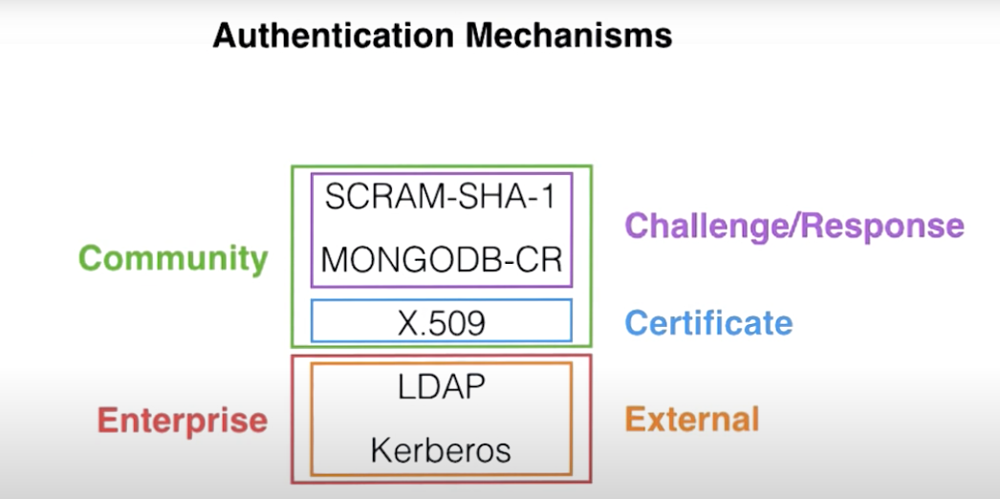

#   Mongodb

*   MongoDB enables to build applications faster, handle highly diverse data types, and manage applications more efficiently at scale.
*   MongoDB removes the complex object-relational mapping  
*   Flexible data model means that your database schema can evolve with business requirements.

##  Architecture & Philosophy & Features

*   Flexibility
    *   Flexible Schema (Dynamic Schema)
    *   Document Structure
    *   MongoDB documents are polymorphic – fields can vary from document to document within a single collection
    *   extensible
    *   Key and Values
*   Scalability(Sharding)
*   Performance
*   Availability (Replication)
*   Run the database anywhere. 


[M103-MongoDB Architecture](https://www.youtube.com/watch?v=Ue6o5yL9gY0&list=PLdRx_Y99aqhM32Opu8Ze3MpyzBR6M6I20)


##  [CRUD](https://docs.mongodb.com/manual/crud/)
*   [SQL to MongoDB Mapping Chart](https://docs.mongodb.com/manual/reference/sql-comparison/)


### Explain Results
*   queryPlanner - Doesn't execute the query
*   executionStats - Execute the query
*   allPlanExecution - Execute the query

### Covered Queries
When an index covers a query, MongoDB can both match the query conditions and return the results using only the index keys; i.e. MongoDB does not need to examine documents from the collection to return the results.

#### null vs $exisits
*   null - the { item : null } query matches documents that either contain the item field whose value is null or that do not contain the item field.
*   $exisits - Matches the documents that contain the field, including documents where the field value is null. If is false, the query returns only the documents that do not contain the field


##  [Data Modeling](https://docs.mongodb.com/manual/core/data-model-design)

### [Patterns](https://docs.mongodb.com/manual/applications/data-models/)
#### [Building with Patterns: A Summary](https://www.mongodb.com/blog/post/building-with-patterns-a-summary)


##  [Indexing and Performance](https://docs.mongodb.com/manual/indexes/)

### Index Types

####    Primary Index: 
*   Every Collection has a primary key index

####    Compound Index: 
*   Index against multiple keys in the document

####    MultiKey Index: 
*   Index into arrays 

####    Text Indexes: 
*   Support for text searches 

####    GeoSpatial Indexes: 
*   2d & 2dSphere indexes for spatial geometries

####    Hashed Indexes: 
*   Hashed based values for sharding

####    Wildcard Indexes

### Index Features

####    TTL Indexes: 
*   Single Field indexes, when expired delete the
document

####    Unique Indexes: 
*   Ensures value is not duplicated

####    Partial Indexes: 
*   Expression based indexes, allowing indexes on
subsets of data

####    Case Insensitive Indexes: 
*   Supports text search using case insensitive search

####    Sparse Indexes: 
*   Only index documents which have the given field even it is null value


##  [Aggregation](https://docs.mongodb.com/manual/aggregation/)
 *  [SQL to Aggregation Mapping Chart](https://docs.mongodb.com/manual/reference/sql-aggregation-comparison/)
 *  
 
##  [Replication](https://docs.mongodb.com/manual/replication/)

*   Replication duplicates the data-set.
*   To maintain strong data redundancy and high availability
*   CAP (Consistency, Availability, and Partition tolerance)
*   Statement-based replication is platform independent ands agnostic of operating system, because statements do not depend on a specific byte makeup or instruction set.
*   MongoDB uses statement-based replication, not binary replication.
*   MongoDB uses a small variation of statement-based replication which reduces statements to idempotent versions so they can be repeated.
*   Both methods of replication are accurate; however they do vary in speed and variability across operating systems.

### Replica Set


*   A replica set in MongoDB is a group of mongod processes that maintain the same data set.
*   High availability & fail-over(RAFT Protocol) 
    *   Replica sets use fail-over to provide high availability to client applications.
    *   In some cases, replication can provide increased read capacity as clients can send read operations to different servers.
* Members can have different roles and specific purposes
    *   primary
    *   secondary
    *   arbiter - An arbiter participates in elections but does not hold data ( does not provide data redundancy) An arbiter has priority 0 and exactly 1 election vote.
    *   hidden -- not visible to applications (reporting purpose and backups) (must always be priority 0 members and so cannot become primary)
    *   delayed (slaveDelay)
        *   do vote in elections for primary, if members[n].votes is set to 1
        *   acknowledge the "majority" write operation when members[n].votes greater than 0 and Delayed secondaries can return write acknowledgment no earlier than the configured slaveDelay.
```json
    {
       "_id" : <num>,
       "host" : <hostname:port>,
       "arbiterOnly" : false,
       "buildIndexes" : true,
       "hidden" : false,
       "priority" : 0,
       "tags" : { },
       "slaveDelay" : NumberLong(0),
       "votes" : 0
    }
    
```
*   Replica sets ensure high availability. This implies that if a given node fails, regardless of its role, the availability of the system will be ensured by failing over the role of primary to an available secondary node through an election.
*   Arbiters should not be used lightly and their utilization in the set is highly discouraged. (https://stackoverflow.com/questions/18211154/why-do-we-need-an-arbiter-in-mongodb-replication)
*   Enabling internal authentication in a replica set implicitly enables client authentication.
*   When connecting to a replica set, the mongo shell will redirect the connection to the primary node.
*   rs.initiate() should only be run on one node in the replica set.
*   An arbiter will always be an arbiter whereas a primary may step down and become a secondary and a secondary may become the primary during an election.

##### Voting
*   Members with a priority value of 0 cannot become primary and do not seek election.
*   A non-voting member has both votes and priority equal to 0:
*   Non-voting members must have priority of 0 and Members with priority greater than 0 cannot have 0 votes.
*   The priority 0 member must also be a voting member (i.e. members[n].votes is greater than 0)
*   We can have up to 50 replica set members, but only 7 of those will be voting members.

####    Fail-Over and Elections

*   Nodes with priority 0 cannot be elected primary.
*   Setting a node's priority to 0 guarantees that node will never become primary.
*   Nodes with higher priority are more likely to be elected primary.
*   Raising a node's priority doesn't guarantee that node will be elected primary, but it does increase the likelihood.
*   If a majority of nodes are unavailable, elections cannot take place.
*   Priority and recency of a node's oplog dictates which nodes are more likely to become primary.
*   When reading from a replica set with readConcern majority all documents that have been majority committed by the replica set will be returned to the application.
*   When two nodes go down in a three-node replica set, the third node becomes a secondary regardless of whether it started as a primary.

#### ReplcaSet Node-1 Congfig
```
storage:
  dbPath: /var/mongodb/db/node1
net:
  bindIp: 192.168.103.100,localhost
  port: 27011
security:
  authorization: enabled
  keyFile: /var/mongodb/pki/m103-keyfile
systemLog:
  destination: file
  path: /var/mongodb/db/node1/mongod.log
  logAppend: true
processManagement:
  fork: true
replication:
  replSetName: repl-example
```

#### [oplog.rs](https://docs.mongodb.com/manual/core/replica-set-oplog/)
* The oplog (operations log) is a special capped collection that keeps a rolling record of all operations that modify the data stored in your databases.
* oplog.rs is central to our replication mechanism
* Each operation in the oplog is idempotent. That is, oplog operations produce the same results whether applied once or multiple times to the target dataset.
* The oplog.rs collection holds all the statements that get replicated across the different replica set members.
* capped collection -- We cap the oplog.rs collection instead of dropping it entirely.
* replication window is proportional to the system load . The size of oplog will impact the replication window
* one operation may result in many oplog.rs entries (idempotence)
* local database holds important information. What happen in local stays local . Any data written to local database does not get replicated to other nodes.

#####   Capped Collection
*   Capped collections are fixed-size collections that support high-throughput operations that insert and retrieve documents based on insertion order. Capped collections work in a way similar to circular buffers: once a collection fills its allocated space, it makes room for new documents by overwriting the oldest documents in the collection.
*   You cannot shard a capped collection.
*   The aggregation pipeline stage $out cannot write results to a capped collection.

**Write Concern** : The level of acknowledgment requested from MongoDB for write operations to a standalone mongod or to replica sets or to sharded clusters.

**Read Preferences** : The request is routed according to the read preference option (driver option)

**Read Concern** : The request is executed according to the read concern option (query option)

##  [Sharding](https://docs.mongodb.com/manual/sharding/)

*   Sharding partitions the data-set into discrete parts or distributed collections.
*   mongos - query router -routes queries to shards - dispatches the query to the appropriate shards based on the shard key.
    *   Determines which shard to route a request, it consults the config servers for the collection's metadata.

### When to Shard
*   Is it viable to economically to scale up
    *   throug-put , speed, volume
*   Operational impact on scalability  
    *   backup, restore, initial sync operation cost large data set
*   Operation workload - indexes size
*   Single Thread operations (Aggregation pipeline commands)
*   Geographical distributed data (Zone sharding)
*   Our organization outgrows the most powerful servers available, limiting our vertical scaling options.
*   Government regulations require data to be located in a specific geography.

#### CSRS conf
```
sharding:
  clusterRole: configsvr
replication:
  replSetName: csrs-example
security:
  keyFile: /var/mongodb/pki/keyfile
net:
  bindIp: localhost,192.168.103.100
  port: 26001
systemLog:
  destination: file
  path: /var/mongodb/db/csrs1.log
  logAppend: true
processManagement:
  fork: true
storage:
  dbPath: /var/mongodb/db/csrs1
```

### [Shard Keys](https://docs.mongodb.com/manual/core/sharding-shard-key/index.html)
As of MongoDB 4.2, the shard key value is mutable, even though the shard key itself is immutable.
*   Shard key fields must exist in every document in the collection
*   Shard key fields must be indexed
*   Indexes must exit first before you can select the indexed fields for your shard key
*   Shard keys are permanent - you can't unshard a sharded collection
*   Shard keys are immutable. Furthermore, their values are also immutable. 
*   Sharding is a permanent operation.

#### Picking a Good Shard Key
The goal is shard key whose values provides good write distribution

*   Cardinality - High Cardinality == many possible unique shard key values
    *   High cardinality provides more shard key values, which determines the maximum number of chunks the balancer can create.
*   Frequency - Low Frequency == low repetition of a given unique shard key value
    *   High frequency means that most documents fall within a particular range. If the majority of documents contain only a subset of the possible shard key values, then the chunks storing those documents become a bottleneck within the cluster.
*   Monotonic Change - Avoid shard keys that change monotonically
    *   If the shard key value monotonically increased, all new inserts would be routed to the chunk with maxKey as the upper bound.
    *   Monotonically changing shard keys result in write operations going to a single shard, and are not performant.
*   Provides Read isolation
*   You cannot unshard a collection once sharded.
*   You cannot update a shard key once you have sharded a collection.
*   You cannot update the values for that shard key for any document in the collection.


### Ranged Sharding
*   Targeted operations
*   Values are “close” are more likely to reside on the same chunk.
*   Poorly considered shard keys can result in uneven distribution of data

### Hashed Sharding
*   Broadcast operations (range-based queries on the shard key )
*   More even distribution data
*   Used for shard key change monotonically
*   You cannot specify a unique constraint on a hashed index.   

### Zoned Sharding 

##  [Security](https://docs.mongodb.com/manual/security/)

##  [Transactions](https://docs.mongodb.com/master/core/transactions/)
*   In version 4.0, MongoDB supports multi-document transactions on replica sets.
*   In version 4.2, MongoDB introduces distributed transactions, which adds support for multi-document transactions on sharded clusters and incorporates the existing support for multi-document transactions on replica sets.
*   An operation on a single document is atomic..   
*   Supports multi-document /distributed transactions in MongoDB 4.2.
*   Multi-document/Distributed transactions transactions are atomic on sharded clusters and replica sets from 4.2. (i.e. provide an “all-or-nothing” proposition):
*   Transactions whose write operations span multiple shards will error and abort if any transaction operation reads from or writes to a shard that contains an arbiter.

##  [Storage](https://docs.mongodb.com/manual/storage/)
*   WiredTiger
*   ~~MMAPv1~~ - Starting in version 4.2, MongoDB removes the deprecated MMAPv1 storage engine.
*   In-Memory
*   GridFS: GridFS is a versatile storage system that is suited to handling large files, such as those exceeding the 16 MB document size limit.
*   journal: The journal is a log that helps the database recover in the event of a hard shutdown.

### WiredTiger
*   Default storage engine
*   Document level locking -  multiple clients can modify different documents of a collection at the same time.
*   Compressions -  snappy(fast)  - zlib - zstd ( MongoDB 4.2)
*   Better performance - Stores data in B-Trees
*   Two caches  [WT cache] -> [File system cache] -> [Disk]

## Security

### Authentication vs. Authorisation
*   Verifies the identity of a user Vs Verifies the privileges of user.
*   Who are you ? vs What you have access to?
*   Authentication enables Authorisation.

####    Authentication Mechanisms

*   Client / User
    *   SCRAM-SHA-1
    *   MONGODB-CR [ Deprecated as of MongoDB 3.0 ] 
    *   X.509
    *   External Authentication mechanism supported in Enterprise version
        *   LDAP [Lightweight Directory Access Protocol]
        *   Kerberos (Very secure and specific for authentication)
            *   authentication protocol
*   Internal (Replica Set / Sharded Cluster authenticates between them)
    *   This automatically enables client authentication. 
    *   Keyfile (SCRAM-SHA-1)
        *   shared password
        *   copy exists on each member
        *   whitespace ignored
        *   6-1024 Base64 characters
    *   X.509
    
   

#####  SCRAM-SHA-1 
*   Default in mongodb
*   Challenge / Response authentication mechanism
*   Username / Password

###### Attacks

*   [Eavesdropping](https://www.ecpi.edu/blog/what-is-eavesdropping-in-computer-security)
    *   Attacker reads all the communication between client / server.
    *   Client never send plain text password over network
*   Reply
    *   Attacker resend the valid request to server.
    *   Mitigated by each authentication session. Unique random string valid for single session.
*   Database compromise
    *   Attacker reads from server persistent memory.
    *   Hash the password before server.
*   Malicious server

#####  X.509 Certificates
*   Certificate based
*   Required to have TLS

####

```shell script
mongod --auth --config /usr/local/etc/mongod.conf
mongo --eval "db.getSiblingDB('admin').shutdownServer()"

```

##  MongoDB Reference

*   [MongoDB Architecture Guide: Overview August 2019](https://info-mongodb-com.s3.us-east-1.amazonaws.com/MongoDB_Architecture_Guide.pdf)
*   [MongoDB Architecture Guide](https://webassets.mongodb.com/_com_assets/collateral/MongoDB_Architecture_Guide.pdf)
*   [On Demand Course Catalog: ANZ Region](https://university.mongodb.com/on_demand/catalog/3167)
*   [Outgoing port tester](http://portquiz.net:27017/)
*   [MongoDB University Discussion Forum](https://discourse.university.mongodb.com/)
*   [MongoDB Enterprise Downloads](https://www.mongodb.com/download-center/enterprise/releases)
*   [Bye bye Mongo, Hello Postgres](https://www.theguardian.com/info/2018/nov/30/bye-bye-mongo-hello-postgres)
*   [Webinar: Scaling MongoDB](https://www.mongodb.com/presentations/webinar-scaling-mongodb-1)
*   [Webinar: Sharding Methods for MongoDB](https://www.mongodb.com/presentations/webinar-sharding-methods-mongodb)
*   [SQL to MongoDB Mapping Chart](https://docs.mongodb.com/manual/reference/sql-comparison/)
*   [SQL to Aggregation Mapping Chart](https://docs.mongodb.com/manual/reference/sql-aggregation-comparison/)
*   [Performance Best Practices: MongoDB Data Modeling and Memory Sizing](https://www.mongodb.com/blog/post/performance-best-practices-mongodb-data-modeling-and-memory-sizing)
*   [Cert Guide](https://university.mongodb.com/exam/guide)
*   [certification](https://university.mongodb.com/certification)
*   [Building with Patterns: A Summary](https://www.mongodb.com/blog/post/building-with-patterns-a-summary)
*   [MongoDB Architecture Explained](https://www.ibmbpnetwork.com/linux-blog/mongodb-architecture)