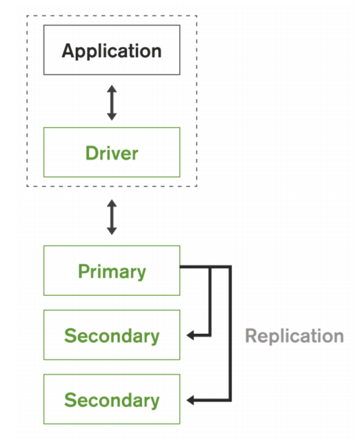

#   Mongodb

*   MongoDB enables to build applications faster, handle highly diverse data types, and manage applications more efficiently at scale.
*   MongoDB removes the complex object-relational mapping  
*   Flexible data model means that your database schema can evolve with business requirements.

##  Architecture & Philosophy & Features

*   Flexibility
    *   Flexible Schema (Dynamic Schema)
    *   Document Structure
    *   MongoDB documents are polymorphic – fields can vary from document to document within a single collection
    *   extensible
    *   Key and Values
*   Scalability(Sharding)
*   Performance
*   Availability (Replication)
*   Run the database anywhere. 

[M103-MongoDB Architecture](https://www.youtube.com/watch?v=Ue6o5yL9gY0&list=PLdRx_Y99aqhM32Opu8Ze3MpyzBR6M6I20)

##  [CRUD](https://docs.mongodb.com/manual/crud/)
*   [SQL to MongoDB Mapping Chart](https://docs.mongodb.com/manual/reference/sql-comparison/)

#### null vs $exisits
*   null - the { item : null } query matches documents that either contain the item field whose value is null or that do not contain the item field.
*   $exisits - Matches the documents that contain the field, including documents where the field value is null. If is false, the query returns only the documents that do not contain the field

##  [Data Modeling](https://docs.mongodb.com/manual/core/data-model-design)

### [Patterns](https://docs.mongodb.com/manual/applications/data-models/)
#### [Building with Patterns: A Summary](https://www.mongodb.com/blog/post/building-with-patterns-a-summary)

##  [Indexing and Performance](https://docs.mongodb.com/manual/indexes/)

### Index Types

####    Primary Index: 
*   Every Collection has a primary key index

####    Compound Index: 
*   Index against multiple keys in the document

####    MultiKey Index: 
*   Index into arrays 

####    Text Indexes: 
*   Support for text searches 

####    GeoSpatial Indexes: 
*   2d & 2dSphere indexes for spatial geometries

####    Hashed Indexes: 
*   Hashed based values for sharding

### Index Features

####    TTL Indexes: 
*   Single Field indexes, when expired delete the
document

####    Unique Indexes: 
*   Ensures value is not duplicated

####    Partial Indexes: 
*   Expression based indexes, allowing indexes on
subsets of data

####    Case Insensitive Indexes: 
*   supports text search using case insensitive search

####    Sparse Indexes: 
*   Only index documents which have the given field

##  [Aggregation](https://docs.mongodb.com/manual/aggregation/)
 *  [SQL to Aggregation Mapping Chart](https://docs.mongodb.com/manual/reference/sql-aggregation-comparison/)
 *  
 
##  [Replication](https://docs.mongodb.com/manual/replication/)
*   To maintain strong data redundancy and high availability
*   CAP (Consistency, Availability, and Partition tolerance)
*   Statement-based replication is platform independent ands agnostic of operating system, because statements do not depend on a specific byte makeup or instruction set.
*   MongoDB uses statement-based replication, not binary replication.
*   MongoDB uses a small variation of statement-based replication which reduces statements to idempotent versions so they can be repeated.
*   Both methods of replication are accurate; however they do vary in speed and variability across operating systems.

### Replica Set

*   A replica set in MongoDB is a group of mongod processes that maintain the same data set.

##  [Sharding](https://docs.mongodb.com/manual/sharding/)

*   mongos - query router - dispatches the query to the appropriate shards based on the shard key.

### Ranged Sharding
### Hashed Sharding
### Zoned Sharding 

##  [Security](https://docs.mongodb.com/manual/security/)

##  [Transactions](https://docs.mongodb.com/master/core/transactions/)

*   An operation on a single document is atomic..   
*   Supports multi-document /distributed transactions  in MongoDB 4.2.

##  [Storage](https://docs.mongodb.com/manual/storage/)

##  MongoDB Reference

*   [MongoDB Architecture Guide: Overview August 2019](https://info-mongodb-com.s3.us-east-1.amazonaws.com/MongoDB_Architecture_Guide.pdf)
*   [MongoDB Architecture Guide](https://webassets.mongodb.com/_com_assets/collateral/MongoDB_Architecture_Guide.pdf)
*   [On Demand Course Catalog: ANZ Region](https://university.mongodb.com/on_demand/catalog/3167)
*   [Outgoing port tester](http://portquiz.net:27017/)
*   [MongoDB University Discussion Forum](https://discourse.university.mongodb.com/)
*   [MongoDB Enterprise Downloads](https://www.mongodb.com/download-center/enterprise/releases)
*   [Bye bye Mongo, Hello Postgres](https://www.theguardian.com/info/2018/nov/30/bye-bye-mongo-hello-postgres)
*   [Webinar: Scaling MongoDB](https://www.mongodb.com/presentations/webinar-scaling-mongodb-1)
*   [Webinar: Sharding Methods for MongoDB](https://www.mongodb.com/presentations/webinar-sharding-methods-mongodb)
*   [SQL to MongoDB Mapping Chart](https://docs.mongodb.com/manual/reference/sql-comparison/)
*   [SQL to Aggregation Mapping Chart](https://docs.mongodb.com/manual/reference/sql-aggregation-comparison/)
*   [Performance Best Practices: MongoDB Data Modeling and Memory Sizing](https://www.mongodb.com/blog/post/performance-best-practices-mongodb-data-modeling-and-memory-sizing)
*   [Cert Guide](https://university.mongodb.com/exam/guide)
*   [certification](https://university.mongodb.com/certification)
*   [Building with Patterns: A Summary](https://www.mongodb.com/blog/post/building-with-patterns-a-summary)
*   [MongoDB Architecture Explained](https://www.ibmbpnetwork.com/linux-blog/mongodb-architecture)